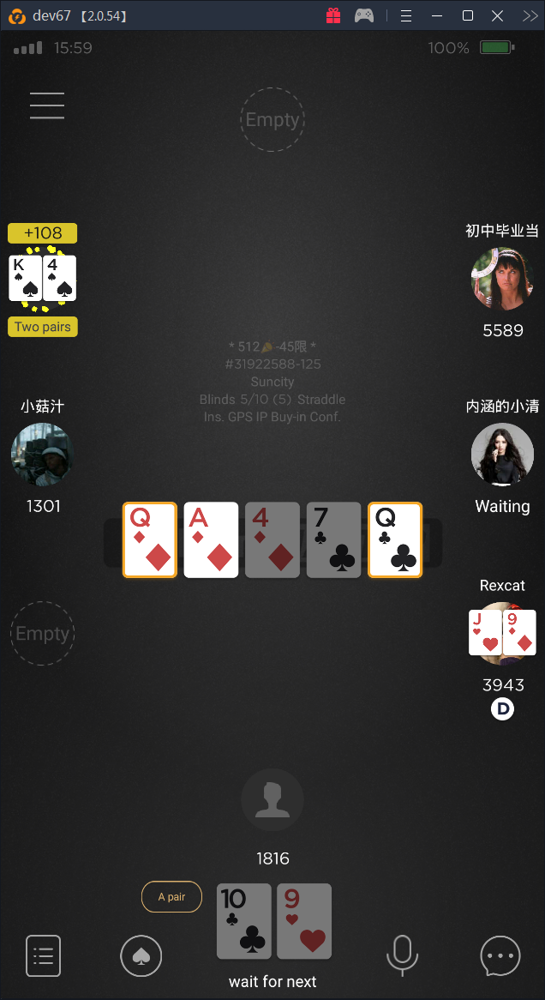

# Poker cards template-based recognition
This project shows my vision of good OOP design  
It's kind of little exercise for fun and illustration of some best practices

Project have this features:
* following SOLID principles
* pure Java, no libs
* high cohesion
* low coupling, even in configuration
* immutable objects
* thread safety
* clean functions
* CQRS
* no one setter
* no one static field
* no one static method (except 'main')
* constructor DI without any IoC container
* testability
* loading configuration from properties files
* nested utils classes in interfaces/enums for better cohesion, and at the same time for separation domain object contract from utils contract (instead of using static methods in separate procedure-like utility classes)
---  
Recognition accuracy: 100%  
Test images full pack `images_marked.zip` could be downloaded from release: [poker-board-recognition v2.0](https://github.com/antonov256/poker-board-recognition/releases/tag/v2.0)

Example input image:  
  
Recognition result:  
`QdAd4d7cQc.png — QdAd4d7cQc`  
